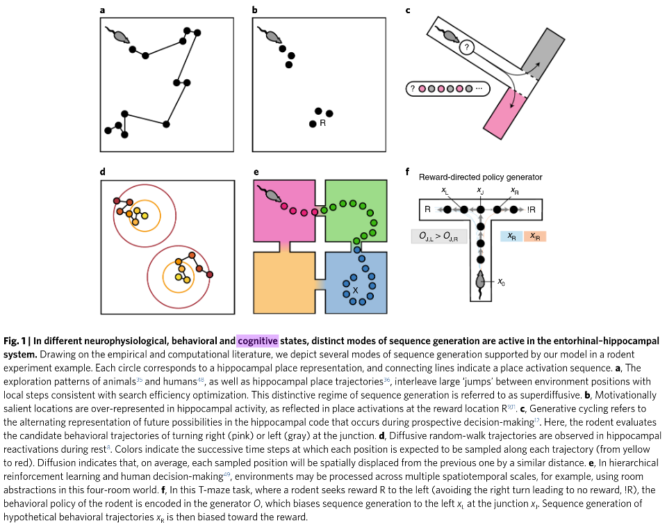
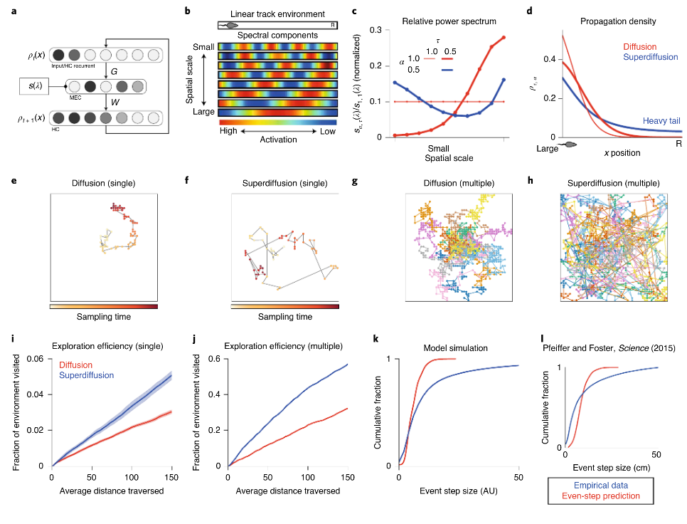
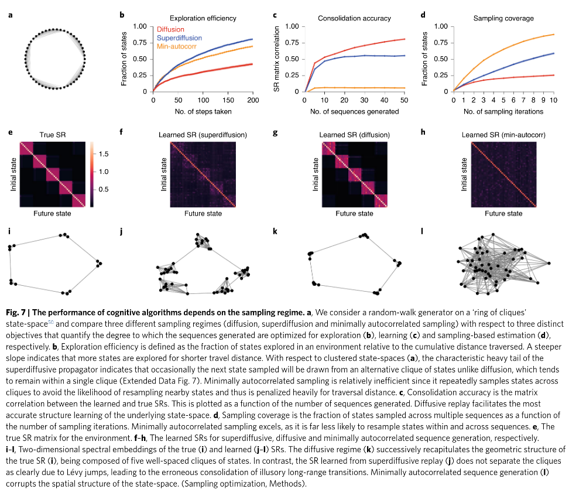

* *Post status*: [Nature link](https://www.nature.com/articles/s41593-021-00831-7).
* *In plain words*: Your brain replays memories differently depending on what it's trying to do.
* *Why it matters*: Connects replay regimes (superdiffusive, diffusive) to cognitive functions (foraging, consolidation).

They develop a theory of episodic memory sampling for optimal performance under
different objectives:

> Exploration, consolidation and planning depend on the generation of sequential
> state representations (...) We theorize how the brain should adapt internally
> generated sequences for particular cognitive functions and propose a neural
> mechanism by which this may be accomplished within the EHC.

[Background on place/grid cells and EHC to follow this paper]()

## Entorhinal-Hippocampal Circuit (EHC)

Handles replay memory, a *temporally compressed* representation of previously
experienced trajectory embedded within hippocampal Sharp-Wave Ripples (SWRs).
\[ What does it mean to be *embedded within* here? \]

Initially observed during sleep, replay is thought to subserve long-term memory
consolidation in neocortical networks.

> While rodents quietly rest, ensemble [place cell](https://biology.stackexchange.com/questions/64957/understanding-the-concept-of-a-place-field-and-the-difference-between-place-ce)
> activity appears to random walk through a cognitive map of a familiar
> environment instead of veridically replaying a rodent’s physical traversals.

## Modes of sequence generation

Hypothetical framework of rodent decision-making.
(a) Superdiffusive ($$\alpha<1$$) regime: large jumps with local steps
consistent with search efficiency optimization.
(b) Rewards are overrepresented in place cell density.
(c) Alternating locations during decision making.
(d) During rest, rodent reactivates equally-spaced place cells (yellow-to-red).
(f) Sequence generation biased toward the reward (left).

In all diagrams, time flows yellow-to-red:

$$x = (x_0, x_1, \cdots, x_t)$$, where state space $$X$$ is considered discrete.
"Master equation" defined by e.g. rodent initial position $$\rho_0 = p(x_0)$$;
$$\tau \frac{d\rho}{dt} = \rho O$$, with $$O$$ an *infinitesimal generator*.

Analytic solution $$\rho_{\Delta t} = \rho_0 \exp\{\tau^{-1}\Delta t O\}$$,
which they call the "propagator" $$P_\tau$$: $$x_{t+1} \approx 1_{x_t} P_\tau$$.
Here $$1_x$$ is a one-hot vector indicating current state.

This generic framework can be adapted to different environments.

### Foraging in an open environment

Superdiffusive.
Trade-off between scales (Levy flight foraging hypothesis); interleaving
$$\tau \rightarrow 0$$ for large spatial scales with
$$\tau \gg 0$$ oversampling a small area.
Levy is heavy-tailed; besides high probability of sampling a nearby position, it
has a small probability of generating a large jump.

> Theoretical analysis and simulations have shown that exploration efficiency is
> maximized by interleaving jumps (that is, sampling successive positions
> separated by a large distance) with local search patterns.

Based on some mathematical considerations, introduce param. $$\alpha$$
s.t. $$s_{\tau,\alpha}(\lambda) = \exp \{ -\tau^{-1} |\lambda|^\alpha$$.
When alpha is less than 1, probability mass is distributed towards remote
positions (fig 2d).

### Goal-directed with heterogeneous jumps

Superdiffusive (heavy-tail) regime.
CA1 activity of rats alternating random foraging and spatial memory tasks.

> neural decoding analyses revealed the rapid sequential encoding of positions
> across the environment while the rats were task engaged but immobile.

### Diffusive reactivations for structure consolidation

Occuring during rest.

> In an experiment where rats foraged for randomly dropped food pellets, spatial
> trajectories were decoded from SWRs during a postexploration rest period
> ('sleep SWRs') as well as during immobile pauses in active exploration ('wake
> SWRs') [...] wake SWRs superdiffusive, sleep SWRs encode random walks (α = 1)

> We simulated a learning process whereby an environment representation,
> formalized as the successor representation (SR), is acquired through
> error-driven learning based on state sequences28,39. The SR is a predictive
> state representation whereby the representation of each state encodes the rate
> at which other states will be visited in the future,

### Shifting between regimes

Dysregulated entorhinal input degrades spatiotemporal consistency of hippocampal
activity.

> our model requires that the spectral modulation of MEC activity be coherently
> balanced across grid modules.

Not really sure what that means.
What are grid modules exactly?
What is MEC activity?

$$\alpha > 1$$ drives turbulent behavior.
Model is reminiscent of conceptual disorganization, symptom of schizophrenia.

## Discussion

> Sequential hippocampal reactivations traversing cognitive maps are viewed as a
> potential neural substrate of internal simulation at the systems level.

> Our neural network model is designed to provide conceptual clarity regarding
> how entorhinal spectral modulation may explain variations in hippocampal
> sequence generation.

Then they mention some suggestions for future work way beyond my comprehension.
