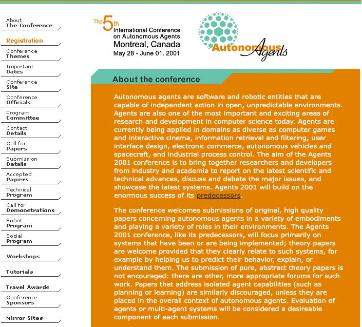

* *Post status*: quick writeup xref [leaflet](https://toni.leaflet.pub/3mqyauxwmis2b)
* *In plain words*: screenshots of an old agentic conference website back from when these things required effort.
* *Writing style*: just references

agents are not a new thing.
same but not the same.

while searching for old references I bumped into 
[agents2001](https://agents2001.csc.liv.ac.uk/about.html)

in addition to the lovely 2001 verdana aesthetic it keeps some nice references.

_vibe_-added [`verdana.css`](https://github.com/tkukurin/tkukurin.github.io/tree/master/css)
to commemorate

